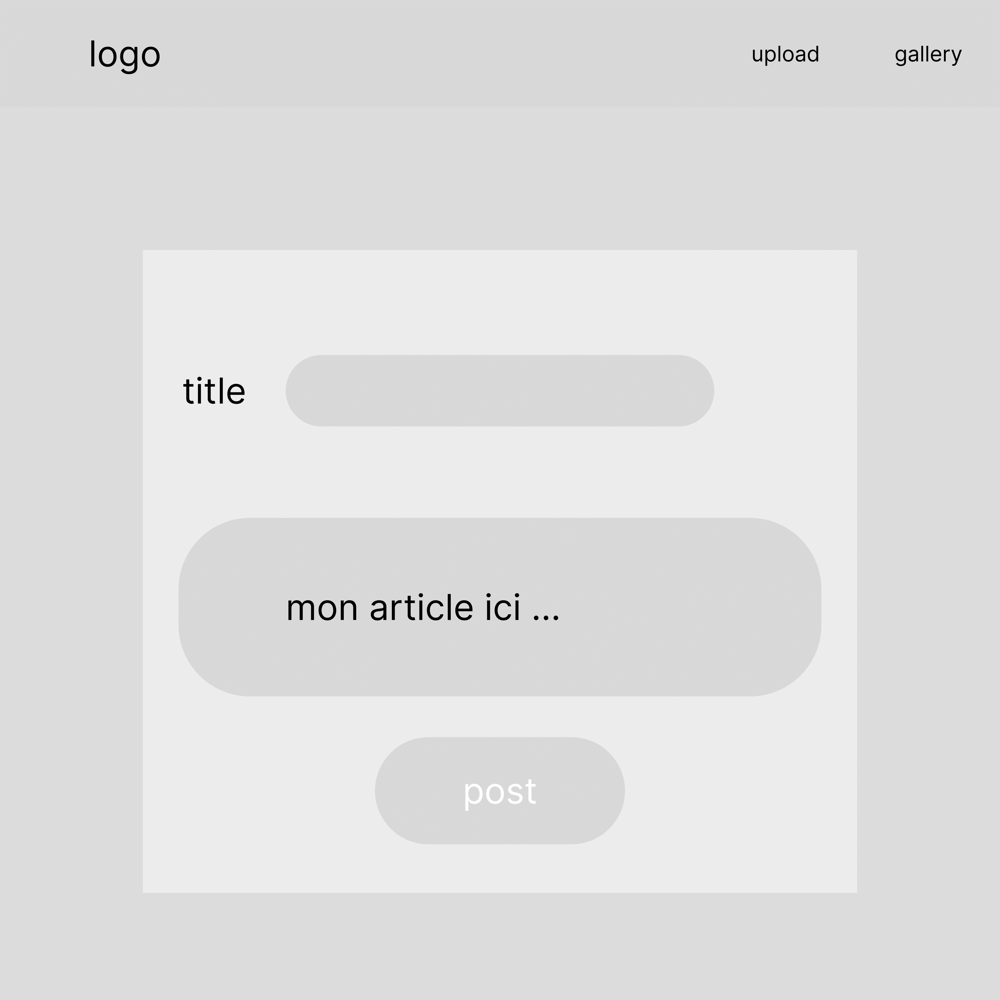
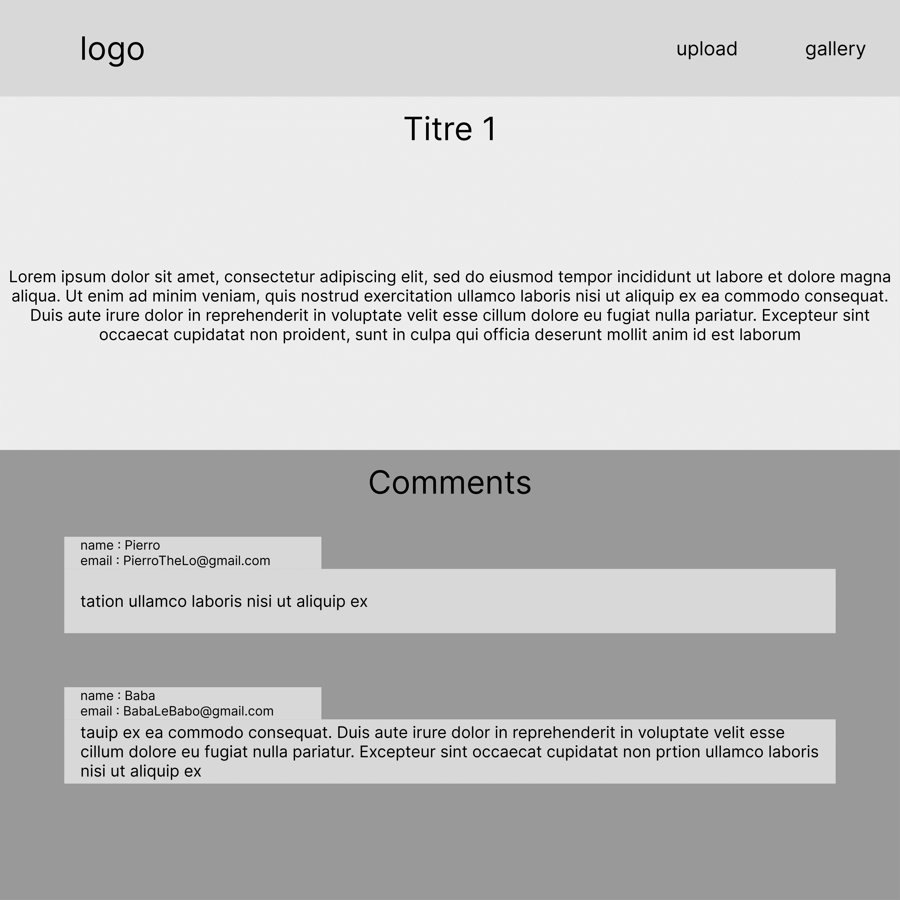

# 🦄 THE UNICORN BLOG

Ce projet se réalise en équipe de 2 personnes.
Vous intégrerez les 3 pages fournies en respectant les features demandées.
Vous utiliserez la méthodologie Scrum en utilisant un Kanban.
Il vous faudra également utiliser un logiciel de versionnage type Git.

Si le temps le permet, nous ferons une mise en situation réelle et vous aurez à pitcher votre solution devant un jury en les convaincants de la pertinence de vos choix techniques et de votre organisation.

À vous de jouer!!

## 1. GUIDELINES :

## Stack :
React JS (you can use libraries such as MUI)

## Teams :
2 persons

## Project management :
Scrum (we recommend that you use Trello)

## Delay :
5 days

## Deliveries :
    * repository on gitlab/github
    * link of the online website (we recommend that you use GitHub Page)
    * Trello (screenshots)

______

## 2. Specs (features) :

## Wireframes :
voici les wireframes, le rendu visuel attendu n'est pas important dans un premier temps :

## API

Vous utiliserez l'API https://jsonplaceholder.typicode.com/ qui fournit des données pour les posts/comments/images/users

## Features :
**Le header comprend :**
    * un logo (avec une redirection vers la page accueil
    * un bouton Upload
    * un bouton Gallery

**La page d'accueil comprend :**
    * le header
    * un champ de texte permettant de filtrer les posts
    * les posts 
        Chaque post est cliquable et redirige vers sa page détail

**La page détail de chaque post comprend :**
    * le titre 
    * le contenu de l'article
    * la liste des commentaires liés à ce post (avec le nom et email de l'utilisateur)
        
**La page Gallery comprend :**
    * les photos
    
**La page upload comprend :**
    * un formulaire qui contient :
        un champ titre
        un champ contenu
        un bouton de soumission du formulaire

## Bonus :

* Au lieu d'une page Upload, vous utiliserez une Modal

* Vous ajouterez un formulaire pour poster un commentaire sur chaque article

* Améliorez le rendu visuel